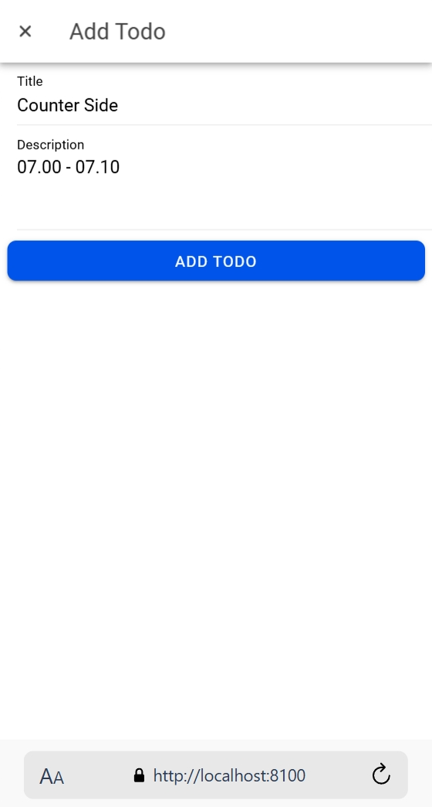
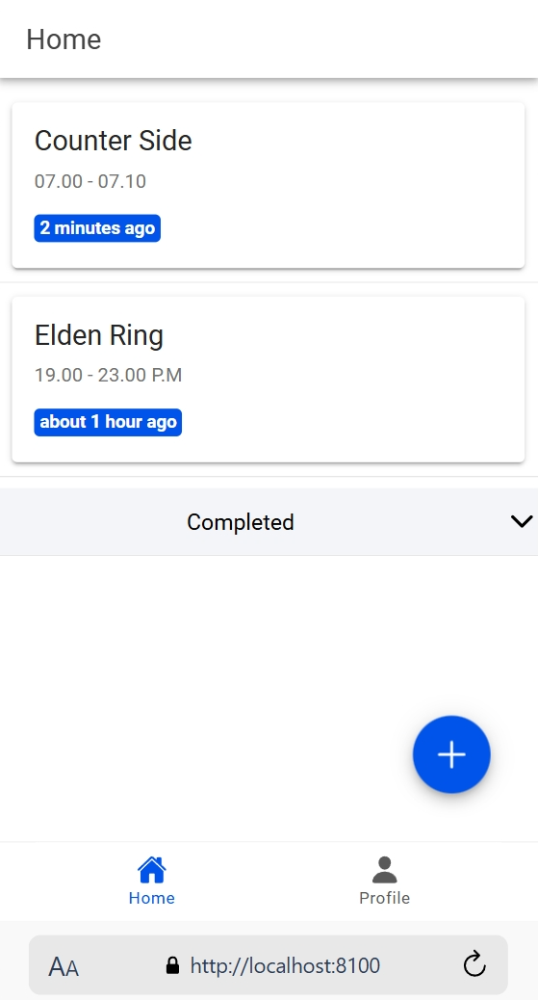
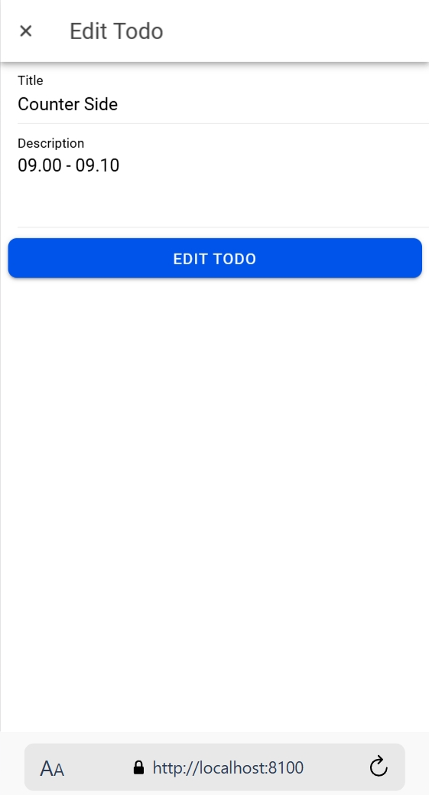
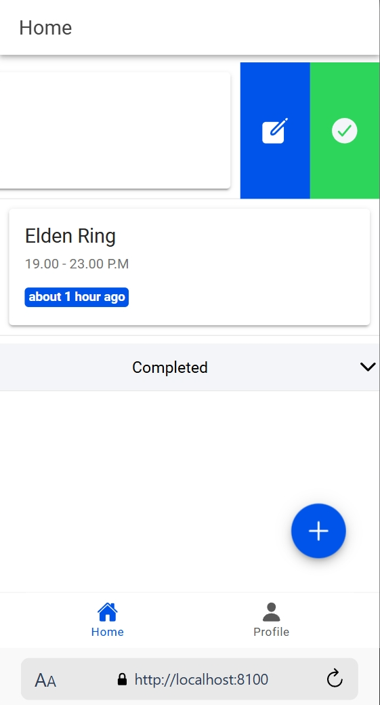
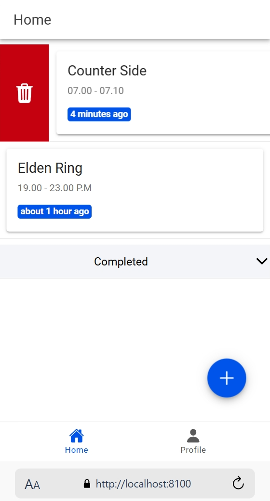
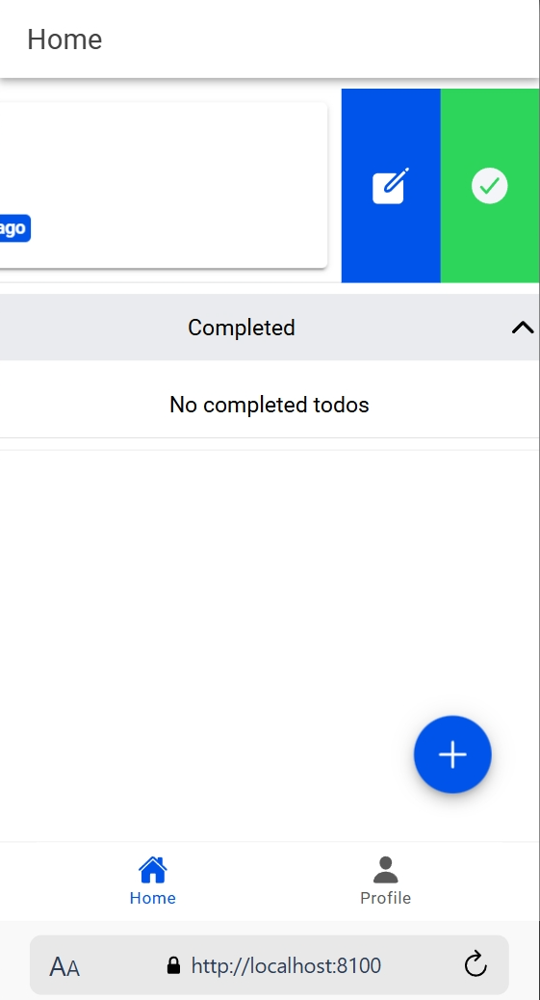
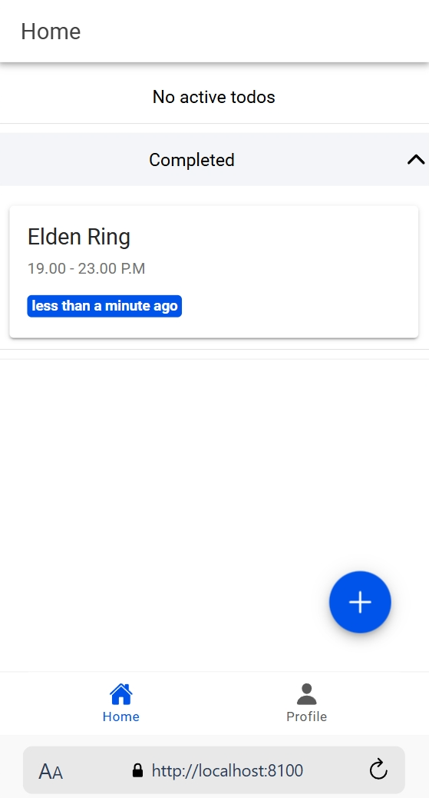

    Nama       : Bagus Wijoyoseno

    NIM        : H1D022030

    Shift Baru : D

    ## Penjelasan dan Screenshot

# Tugas 10 - Pertemuan 11

### 1. Create 

Fitur untuk menambahkan todo baru tersedia dengan input berupa title dan description. Tekan tombol "+" di sudut kanan bawah untuk membuka jendela input. Setelah data diisi, klik tombol "Add Todo" untuk menyimpannya ke dalam Firestore.

  - Saat tombol "+" di klik, maka akan muncul tampilan seperti diatas untuk memasukan input berupa title dan description kedalam Firestore. Setelah data diisi, klik tombol "Add Todo".

### 2. Read

Daftar To Do ditampilkan dengan dua section, yaitu Active Todos dan Completed Todos. Setiap todo menampilkan:

  - Title dari Todo
  - Deskripsi dari Todo 
  - Waktu pembuatan Todo 

### 3. Update

  - Tampilan ini akan muncul ketika ikon pensil di klik saat menggeser Todo yang sudah dibuat lalu pengguna akan masuk halaman update yang berisi Title dan Description yang dapat di edit, lalu klik "Edit Todo".

### 4. Delete

Pengguna dapat menghapus todo dengan menggeser Todo yang ada kearah kanan yang akan memunculkan ikon sampah, pengguna bisa mendelete todo yang dipilih dengan mengklik ikon sampah tersebut dan konfirmasi akan muncul yang menandakan Todo sudah berhasil dihapus.

### 5. Toggle Todo

Pengguna dapat memindahkan todo ke bagian completed/sudah selesai dengan menggeser Todo yang ada kearah kiri yang akan memunculkan ikon centang, pengguna bisa menandai todo yang dipilih dengan mengklik ikon centang tersebut, lalu todo yang terpilih sudah berpindah ke bagian completed/sudah selesai.

